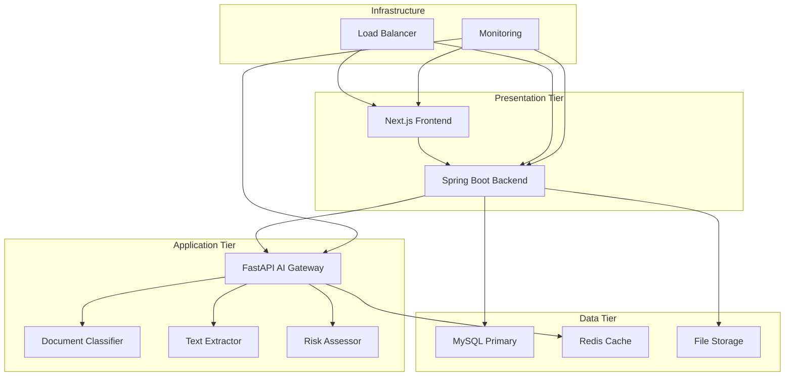

# 🏛️ 기업형 통관 시스템 (Customs Clearance System)

> **전자통관시스템** - AI 기반 수출입 신고서 처리 및 관리 플랫폼

[](LICENSE)
[](https://spring.io/projects/spring-boot)
[](https://nextjs.org/)
[](https://fastapi.tiangolo.com/)
[](https://www.mysql.com/)

## 📋 목차

- [🎯 프로젝트 개요](#🎯-프로젝트-개요)
- [🏗️ 시스템 아키텍처](#🏗️-시스템-아키텍처)
- [🚀 빠른 시작](#🚀-빠른-시작)
- [📁 프로젝트 구조](#📁-프로젝트-구조)
- [🔧 개발 환경 설정](#🔧-개발-환경-설정)
- [📚 API 문서](#📚-api-문서)
- [🧪 테스트](#🧪-테스트)
- [🚀 배포](#🚀-배포)
- [🤝 기여하기](#🤝-기여하기)

---

## 🎯 프로젝트 개요

**통관시스템**은 한국관세청의 수출입 신고서 처리를 위한 현대적이고 효율적인 전자통관 플랫폼입니다.

### ✨ 주요 기능

- 📄 **전자 신고서 관리**: 수입/수출/경유 신고서 작성, 제출, 승인 프로세스
- 🤖 **AI 기반 문서 처리**: 문서 분류, OCR, 리스크 평가 자동화
- 🌐 **다국어 지원**: 한국어/영어 완전 지원
- 📊 **실시간 통계**: 신고서 처리 현황 및 분석 대시보드
- 🔐 **보안 강화**: JWT 인증, RBAC 권한 관리
- 📱 **반응형 UI**: 모든 디바이스에서 최적화된 사용자 경험

### 🎨 기술 스택

**Frontend** | **Backend** | **AI/ML** | **Database** | **Infrastructure**
---|---|---|---|---
Next.js 14.2 | Spring Boot 3.2 | FastAPI 0.110 | MySQL 8.0 | Docker
React 18 | Java 17 | Python 3.11 | Redis | Kubernetes
TypeScript | Spring Security | TensorFlow | MongoDB | nginx
Tailwind CSS | Spring Data JPA | scikit-learn | Elasticsearch | Prometheus

---

## 🏗️ 시스템 아키텍처



### 🔄 3-Tier 아키텍처

1. **🎨 Presentation Tier**: 사용자 인터페이스 및 API 게이트웨이
2. **🧠 Application Tier**: AI/ML 서비스 및 비즈니스 로직
3. **💾 Data Tier**: 데이터 저장소 및 캐시

---

## 🚀 빠른 시작

### 📋 사전 요구사항

- **Docker** & **Docker Compose** 20.10+
- **Node.js** 18.17+
- **Java** 17+
- **Python** 3.11+
- **MySQL** 8.0+ (선택사항 - Docker 사용 시)

### ⚡ 1분 만에 실행하기

```bash
# 1. 저장소 클론
git clone https://github.com/your-org/customs-clearance.git
cd customs-clearance

# 2. 환경 변수 설정
cp .env.example .env

# 3. 전체 시스템 실행
docker-compose up -d

# 4. 서비스 확인
curl http://localhost:3000  # Frontend
curl http://localhost:8080  # Backend API
curl http://localhost:8000  # AI Gateway
```

### 🌐 서비스 접속

| 서비스 | URL | 설명 |
|--------|-----|------|
| **웹 애플리케이션** | http://localhost:3000 | 메인 포털 |
| **API 문서** | http://localhost:8080/swagger-ui | Spring Boot API |
| **AI API 문서** | http://localhost:8000/docs | FastAPI 문서 |
| **데이터베이스** | http://localhost:8081 | phpMyAdmin |
| **모니터링** | http://localhost:3001 | Grafana 대시보드 |

---

## 📁 프로젝트 구조

```
customs-clearance/
├── 📄 README.md                     # 프로젝트 메인 문서
├── 🔧 CLAUDE.md                     # Claude Code 개발 가이드
├── 🐳 docker-compose.yml            # 전체 시스템 오케스트레이션
├── 🔐 .env.example                  # 환경변수 템플릿
├── 🚫 .gitignore                    # Git 제외 파일 설정
│
├── 🎨 presentation-tier/            # Presentation Layer
│   ├── 🌐 backend/                  # Spring Boot API 서버
│   │   ├── 📦 src/main/java/
│   │   │   └── com/customs/clearance/
│   │   │       ├── 🎮 controller/   # REST 컨트롤러
│   │   │       ├── 📊 dto/          # 데이터 전송 객체
│   │   │       ├── 🗃️ entity/       # JPA 엔티티
│   │   │       ├── 🛠️ service/      # 비즈니스 로직
│   │   │       ├── 🗄️ repository/   # 데이터 접근 계층
│   │   │       ├── ⚙️ config/       # 설정 클래스들
│   │   │       └── 🚨 exception/    # 예외 처리
│   │   ├── 📋 src/main/resources/
│   │   │   ├── application.yml      # Spring Boot 설정
│   │   │   └── db/migration/        # Flyway 마이그레이션
│   │   ├── 🧪 src/test/java/        # 단위/통합 테스트
│   │   ├── 📜 pom.xml               # Maven 의존성
│   │   └── 🐳 Dockerfile            # 백엔드 컨테이너 이미지
│   │
│   └── 💻 frontend/                 # Next.js 웹 애플리케이션
│       ├── 📱 src/app/              # App Router (Next.js 13+)
│       │   ├── (auth)/              # 인증 관련 페이지
│       │   ├── (dashboard)/         # 대시보드 페이지들
│       │   ├── layout.tsx           # 루트 레이아웃
│       │   └── page.tsx             # 홈페이지
│       ├── 🧩 src/components/       # React 컴포넌트
│       │   ├── ui/                  # 기본 UI 컴포넌트
│       │   ├── layout/              # 레이아웃 컴포넌트
│       │   ├── forms/               # 폼 컴포넌트
│       │   └── charts/              # 차트 컴포넌트
│       ├── 🛠️ src/lib/              # 유틸리티 라이브러리
│       │   ├── api.ts               # API 클라이언트
│       │   └── utils.ts             # 공통 유틸리티
│       ├── 🎨 src/styles/           # 스타일 파일들
│       ├── 🌍 messages/             # 다국어 메시지
│       │   ├── ko.json              # 한국어
│       │   └── en.json              # 영어
│       ├── 📦 package.json          # 프론트엔드 의존성
│       ├── ⚙️ next.config.js        # Next.js 설정
│       └── 🐳 Dockerfile            # 프론트엔드 컨테이너
│
├── 🤖 application-tier/             # Application Layer (AI/ML)
│   ├── 🚪 ai-gateway/               # FastAPI 메인 게이트웨이
│   │   ├── 📱 app/
│   │   │   ├── 🎯 main.py           # FastAPI 앱 진입점
│   │   │   ├── ⚙️ core/             # 코어 설정
│   │   │   │   ├── config.py        # 환경 설정
│   │   │   │   ├── middleware.py    # 미들웨어
│   │   │   │   └── logging.py       # 로깅 설정
│   │   │   ├── 🛣️ routers/          # API 라우터들
│   │   │   │   ├── health.py        # 헬스체크
│   │   │   │   ├── models.py        # 모델 관리
│   │   │   │   └── ai_gateway.py    # AI 처리 엔드포인트
│   │   │   └── 📋 schemas/          # Pydantic 스키마들
│   │   ├── 📜 requirements.txt      # Python 의존성
│   │   ├── 🐳 Dockerfile            # AI 게이트웨이 컨테이너
│   │   └── 🔧 docker-compose.yml    # AI 스택 오케스트레이션
│   │
│   ├── 🧠 models/                   # AI 모델별 마이크로서비스
│   │   ├── 📄 model-a/              # 문서 분류 모델
│   │   │   └── app/main.py          # 문서 분류 서비스
│   │   ├── 🔍 model-b/              # OCR 텍스트 추출 모델  
│   │   │   └── app/main.py          # OCR 처리 서비스
│   │   └── 🔄 shared/               # 공통 유틸리티
│   │       └── app/
│   │           ├── schemas.py       # 공통 스키마
│   │           └── utils.py         # 공통 함수들
│   │
│   └── 🧪 tests/                    # AI 서비스 테스트
│
├── 💾 data-tier/                    # Data Layer
│   ├── 🗄️ database/                 # 데이터베이스 설정
│   │   ├── mysql/                   # MySQL 설정
│   │   │   ├── config/my.cnf        # MySQL 설정 (한글 지원)
│   │   │   └── init/                # 초기화 스크립트
│   │   │       ├── 01-schema.sql    # 테이블 스키마
│   │   │       └── 02-seed-data.sql # 초기 데이터
│   │   └── migrations/              # 스키마 마이그레이션
│   │
│   ├── 🛠️ scripts/                  # 데이터베이스 관리 스크립트
│   │   ├── test-connection.py       # DB 연결 테스트
│   │   ├── backup.sh                # 백업 스크립트
│   │   └── setup-database.sh        # DB 셋업 스크립트
│   │
│   ├── 🐳 docker-compose.yml        # 데이터 스택 (MySQL + phpMyAdmin)
│   └── 📖 README.md                 # 데이터 계층 가이드
│
├── 🏗️ infrastructure/               # Infrastructure Layer
│   ├── 🐳 docker/                   # Docker 설정들
│   ├── ☸️ k8s/                      # Kubernetes 매니페스트
│   └── 📊 monitoring/               # 모니터링 스택
│
├── 🔄 shared/                       # 공통 리소스
│   ├── 📚 docs/                     # 프로젝트 문서들
│   ├── ⚙️ configs/                  # 공통 설정 파일들
│   └── 🛠️ scripts/                  # 빌드/배포 스크립트들
│
└── 🧪 tests/                        # 통합 테스트
    ├── 🎭 e2e/                      # End-to-End 테스트
    └── 🔗 integration/              # 계층 간 통합 테스트
```

---

## 🔧 개발 환경 설정

### 1️⃣ **Presentation Tier** 개발

#### 🌐 Frontend (Next.js) 개발 서버

```bash
cd presentation-tier/frontend

# 의존성 설치
npm install

# 개발 서버 실행  
npm run dev

# 타입 체크
npm run type-check

# 린팅
npm run lint

# 빌드
npm run build
```

#### 🔧 Backend (Spring Boot) 개발 서버

```bash
cd presentation-tier/backend

# Maven을 사용한 실행
./mvnw spring-boot:run

# 테스트 실행
./mvnw test

# 패키징
./mvnw clean package
```

### 2️⃣ **Application Tier** 개발

#### 🤖 AI Gateway (FastAPI) 개발 서버

```bash
cd application-tier/ai-gateway

# Python 가상환경 생성
python -m venv venv
source venv/bin/activate  # Windows: venv\Scripts\activate

# 의존성 설치
pip install -r requirements.txt

# 개발 서버 실행
uvicorn main:app --reload --host 0.0.0.0 --port 8000

# API 문서 확인: http://localhost:8000/docs
```

### 3️⃣ **Data Tier** 개발

#### 🗄️ MySQL 데이터베이스

```bash
cd data-tier

# Docker로 MySQL 실행
docker-compose up -d

# 연결 테스트
python scripts/test-connection.py

# 데이터베이스 접속: http://localhost:8081 (phpMyAdmin)
```

---

## 📚 API 문서

### 🌐 **REST API 엔드포인트**

#### 📄 신고서 (Declarations) API

| Method | Endpoint | 설명 |
|--------|----------|------|
| `GET` | `/api/declarations` | 신고서 목록 조회 |
| `POST` | `/api/declarations` | 새 신고서 생성 |
| `GET` | `/api/declarations/{id}` | 특정 신고서 조회 |
| `PUT` | `/api/declarations/{id}` | 신고서 수정 |
| `DELETE` | `/api/declarations/{id}` | 신고서 삭제 |
| `POST` | `/api/declarations/{id}/submit` | 신고서 제출 |
| `POST` | `/api/declarations/{id}/approve` | 신고서 승인 |
| `POST` | `/api/declarations/{id}/reject` | 신고서 거부 |

#### 📊 통계 API

| Method | Endpoint | 설명 |
|--------|----------|------|
| `GET` | `/api/declarations/stats` | 신고서 통계 |
| `GET` | `/api/analytics/dashboard` | 대시보드 데이터 |

### 🤖 **AI Gateway API**

#### 🔍 문서 처리 API

| Method | Endpoint | 설명 |
|--------|----------|------|
| `POST` | `/ai/classify-document` | 문서 분류 |
| `POST` | `/ai/extract-text` | OCR 텍스트 추출 |
| `POST` | `/ai/assess-risk` | 리스크 평가 |
| `POST` | `/ai/validate-declaration` | 신고서 검증 |

### 📖 **API 문서 접속**

- **Spring Boot API**: http://localhost:8080/swagger-ui/index.html
- **FastAPI 문서**: http://localhost:8000/docs
- **ReDoc**: http://localhost:8000/redoc

---

## 🧪 테스트

### 🔬 **단위 테스트**

```bash
# Frontend 테스트 (Jest + React Testing Library)
cd presentation-tier/frontend
npm run test
npm run test:coverage

# Backend 테스트 (JUnit + MockMvc)
cd presentation-tier/backend
./mvnw test

# AI Gateway 테스트 (pytest)
cd application-tier/ai-gateway
pytest
pytest --cov=app tests/
```

### 🎭 **통합 테스트**

```bash
# E2E 테스트 (Playwright)
cd tests/e2e
npm install
npx playwright test

# API 통합 테스트
cd tests/integration
python -m pytest api_tests/

# 데이터베이스 테스트
python data-tier/scripts/test-connection.py
```

---

## 🚀 배포

### 🐳 **Docker 배포**

```bash
# 전체 시스템 빌드 및 실행
docker-compose up --build -d

# 특정 서비스만 재시작
docker-compose restart frontend backend

# 로그 확인
docker-compose logs -f ai-gateway

# 시스템 종료
docker-compose down
```

### ☸️ **Kubernetes 배포**

```bash
# Kubernetes 매니페스트 적용
kubectl apply -f infrastructure/k8s/

# 서비스 상태 확인
kubectl get pods -n customs-system

# 서비스 스케일링
kubectl scale deployment frontend --replicas=3
```

---

## 🤝 기여하기

### 🔄 **개발 워크플로우**

1. **Fork** 저장소를 포크합니다
2. **Branch** 기능 브랜치를 생성합니다 (`git checkout -b feature/amazing-feature`)
3. **Commit** 변경사항을 커밋합니다 (`git commit -m 'feat: add amazing feature'`)
4. **Push** 브랜치에 푸시합니다 (`git push origin feature/amazing-feature`)
5. **Pull Request** 를 생성합니다

### 📝 **커밋 컨벤션**

```
<type>(<scope>): <description>

[optional body]

[optional footer(s)]
```

**Types**: `feat`, `fix`, `docs`, `style`, `refactor`, `test`, `chore`

**Examples**:
```bash
feat(auth): add JWT authentication
fix(api): resolve declaration status update bug
docs: update API documentation
style(frontend): improve button component styling
```

### 🧑‍💻 **코딩 스타일**

- **Frontend**: ESLint + Prettier
- **Backend**: Google Java Style Guide  
- **Python**: PEP 8 + Black formatter
- **Database**: 표준 SQL 컨벤션

---

## 📞 지원 및 문의

- **📧 이메일**: customs-dev@customs.go.kr
- **📱 이슈 트래킹**: [GitHub Issues](https://github.com/your-org/customs-clearance/issues)
- **📖 위키**: [프로젝트 위키](https://github.com/your-org/customs-clearance/wiki)

---

## 📄 라이선스

이 프로젝트는 [MIT License](LICENSE) 하에 배포됩니다.

---

## 🙏 감사의 글

- Aivle-18조 팀의 지원과 협력

---

<p align="center">
  <b>🏛️ Made with ❤️ for Customs Service</b>
</p>
