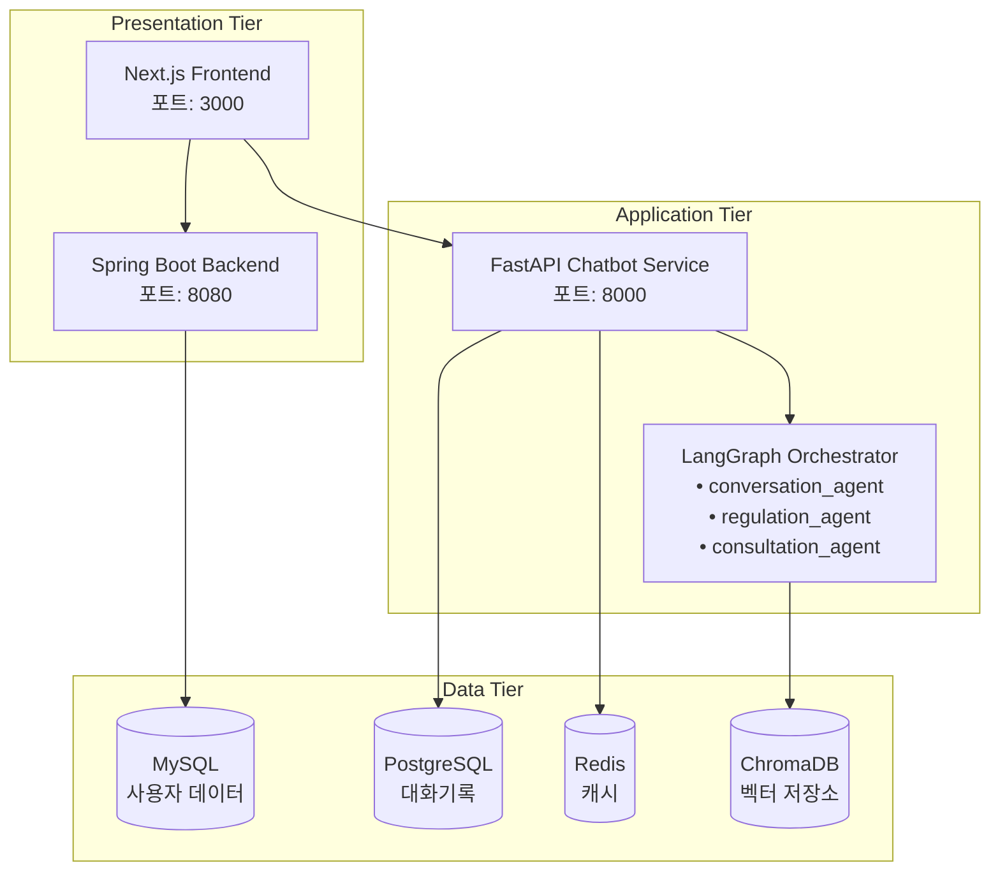

# 🤖 관세 통관 챗봇 FastAPI 서비스

LangGraph 기반 지능형 관세법 전문 챗봇 시스템입니다. 기존 CLI 기반 시스템을 FastAPI로 확장하여 웹 API를 제공하며, PostgreSQL 기반 대화기록 연속성 기능을 제공합니다.

## 📋 목차

- [주요 기능](#주요-기능)
- [아키텍처](#아키텍처)
- [빠른 시작](#빠른-시작)
- [API 문서](#api-문서)
- [성능 최적화](#성능-최적화)
- [배포 가이드](#배포-가이드)
- [모니터링](#모니터링)
- [개발 가이드](#개발-가이드)

## ✨ 주요 기능

### 🧠 지능형 AI 라우팅

- **LangGraph 오케스트레이터**: 사용자 질의를 분석하여 최적의 전문 에이전트로 자동 라우팅
- **3개 전문 에이전트**: 관세법, 무역규제, 상담사례 각각의 전문 AI
- **복잡도 분석**: 질의의 복잡도를 평가하여 적절한 처리 전략 수립

### 💬 대화 연속성 관리

- **PostgreSQL 기반 저장**: 대화 세션 및 메시지 영구 저장
- **컨텍스트 유지**: 이전 대화 내용을 활용한 연속적인 대화
- **세션 관리**: 사용자별 독립적인 대화 세션 관리

### 🔍 고급 검색 기능

- **전문검색**: PostgreSQL GIN 인덱스를 활용한 한국어 전문검색
- **필터링**: 에이전트별, 기간별, 사용자별 필터링 지원
- **실시간 검색**: 빠른 응답속도를 위한 최적화된 쿼리

### ⚡ 성능 최적화

- **Redis 캐싱**: 세션, 메시지, 컨텍스트 데이터 캐싱
- **비동기 처리**: FastAPI + asyncio 완전 비동기 구조
- **연결 풀링**: PostgreSQL, Redis 연결 풀 최적화
- **메모리 관리**: 효율적인 컨텍스트 관리 및 가비지 컬렉션

## 🏗️ 아키텍처

### 전체 시스템 아키텍처



### 데이터 흐름

1. **사용자 요청** → Next.js Frontend
2. **인증 확인** → Spring Boot Backend (JWT)
3. **채팅 요청** → FastAPI Chatbot Service
4. **컨텍스트 로드** → Redis Cache / PostgreSQL
5. **AI 처리** → LangGraph Orchestrator → 전문 에이전트들
6. **벡터 검색** → ChromaDB
7. **응답 저장** → PostgreSQL + Redis Cache
8. **결과 반환** → Frontend

## 🚀 빠른 시작

### 1. 환경 설정

```bash
# 저장소 클론
git clone https://github.com/customs-clearance/model-chatbot-fastapi.git
cd model-chatbot-fastapi

# 환경 변수 설정
cp .env.example .env
# .env 파일을 편집하여 필요한 값들 설정

# uv 설치 (없는 경우)
curl -LsSf https://astral.sh/uv/install.sh | sh
```

### 2. 의존성 설치

```bash
# 모든 의존성 설치
uv sync --dev

# 또는 프로덕션 의존성만
uv sync --no-dev
```

### 3. 데이터베이스 설정

```bash
# PostgreSQL 및 Redis 실행 (Docker 사용)
docker compose up postgres redis chromadb -d
docker compose up postgres redis -d

# 데이터베이스 테이블 생성
uv run python -c "import asyncio; from app.core.database import create_tables; asyncio.run(create_tables())"
```

### 4. 서비스 실행

#### 개발 모드
```bash
# 개발 서버 실행 (핫 리로드)
uv run dev
# 또는
uv run uvicorn main:app --reload --host 0.0.0.0 --port 8004
```

#### 프로덕션 모드
```bash
# Docker Compose로 전체 스택 실행
docker-compose up -d

# 또는 직접 실행
uv run prod
```

### 5. API 테스트

```bash
# 헬스 체크
curl http://localhost:8000/health

# 새 대화 시작
curl -X POST "http://localhost:8000/api/v1/conversations/chat" \
     -H "Content-Type: application/json" \
     -d '{
       "message": "딸기 수입이 가능한가요?",
       "user_id": 1
     }'
```

## 📚 API 문서

### 주요 엔드포인트

| 메서드 | 엔드포인트 | 설명 |
|--------|------------|------|
| `POST` | `/api/v1/conversations/chat` | LangGraph 통합 채팅 |
| `GET` | `/api/v1/conversations/` | 사용자 대화 목록 |
| `GET` | `/api/v1/conversations/{id}/messages` | 대화 메시지 조회 |
| `POST` | `/api/v1/conversations/search` | 전문검색 |
| `GET` | `/health` | 헬스 체크 |
| `GET` | `/docs` | Swagger UI 문서 |

### 채팅 API 예제

```json
POST /api/v1/conversations/chat
{
  "message": "관세법 제1조에 대해 알려주세요",
  "user_id": 1,
  "conversation_id": null,
  "include_history": true
}
```

**응답:**

```json
{
  "conversation_id": "conv_abc123def456",
  "user_message": {
    "id": "msg_user123",
    "role": "user",
    "content": "관세법 제1조에 대해 알려주세요",
    "timestamp": "2025-01-06T10:30:00Z"
  },
  "assistant_message": {
    "id": "msg_ai456",
    "role": "assistant", 
    "content": "관세법 제1조(목적)에 대해 설명드리겠습니다...",
    "agent_used": "conversation_agent",
    "routing_info": {
      "selected_agent": "conversation_agent",
      "complexity": 0.2,
      "reasoning": "관세법 조문 질의로 conversation_agent가 적합"
    },
    "references": [
      {
        "source": "관세법",
        "title": "제1조(목적)",
        "similarity": 0.95,
        "metadata": {"law_name": "관세법"}
      }
    ],
    "timestamp": "2025-01-06T10:30:05Z"
  },
  "is_new_conversation": true
}
```

## ⚡ 성능 최적화

### 🎯 성능 목표

- **응답 시간**: < 2초 (평균 1초 이하)
- **동시 사용자**: 1,000명 이상
- **처리량**: 100 req/sec 이상
- **메모리 사용량**: < 2GB (단일 인스턴스)

### 🔧 최적화 전략

#### 1. 데이터베이스 최적화

```sql
-- PostgreSQL 인덱스 최적화
CREATE INDEX CONCURRENTLY idx_messages_user_time 
ON messages(conversation_id, timestamp DESC);

-- 전문검색 인덱스
CREATE INDEX CONCURRENTLY idx_messages_content_gin 
ON messages USING GIN (to_tsvector('korean', content));

-- 부분 인덱스 (활성 대화만)
CREATE INDEX CONCURRENTLY idx_conversations_active_user 
ON conversations(user_id, updated_at DESC) 
WHERE is_active = true;
```

#### 2. Redis 캐싱 전략

```python
# 계층적 캐싱
cache_strategies = {
    "session": {
        "ttl": 7200,  # 2시간
        "pattern": "session:{user_id}:{conversation_id}"
    },
    "context": {
        "ttl": 3600,  # 1시간
        "pattern": "context:{conversation_id}:{limit}"
    },
    "search": {
        "ttl": 1800,  # 30분
        "pattern": "search:{query_hash}:{filters}"
    }
}
```

#### 3. 비동기 처리 최적화

```python
# 연결 풀 설정
DATABASE_CONFIG = {
    "pool_size": 20,
    "max_overflow": 30,
    "pool_timeout": 30,
    "pool_recycle": 3600
}

REDIS_CONFIG = {
    "max_connections": 50,
    "retry_on_timeout": True,
    "health_check_interval": 30
}
```

#### 4. 메모리 관리
- **컨텍스트 제한**: 최대 20개 메시지로 제한
- **LRU 캐시**: 자주 사용되는 데이터 우선 캐싱
- **가비지 컬렉션**: 주기적인 메모리 정리

### 📊 성능 모니터링

#### 핵심 메트릭스
- **응답 시간**: P50, P95, P99 추적
- **처리량**: RPS (Requests Per Second)
- **오류율**: 4xx, 5xx 에러 비율
- **리소스 사용량**: CPU, 메모리, 디스크 I/O

#### 모니터링 도구
```bash
# Prometheus + Grafana 모니터링 스택 실행
docker-compose --profile monitoring up -d

# 접속 URL
echo "Grafana: http://localhost:3001"
echo "Prometheus: http://localhost:9090"
```

## 🔒 보안 및 백업

### 보안 설정
- **JWT 토큰**: presentation-tier/backend와 토큰 공유
- **CORS 정책**: 허용된 도메인만 접근 가능
- **Rate Limiting**: IP당 요청 수 제한
- **SQL Injection 방지**: ORM 사용 및 파라미터 바인딩

### 백업 전략
```bash
# 데이터베이스 백업 (일일)
docker exec chatbot-postgres pg_dump -U postgres conversations > backup_$(date +%Y%m%d).sql

# Redis 백업
docker exec chatbot-redis redis-cli BGSAVE

# 벡터 데이터베이스 백업
docker exec chatbot-chromadb tar -czf /backup/chroma_$(date +%Y%m%d).tar.gz /chroma
```

### 복구 프로세스
```bash
# PostgreSQL 복구
docker exec -i chatbot-postgres psql -U postgres conversations < backup_20250106.sql

# Redis 복구 (데이터 파일 교체)
docker cp dump.rdb chatbot-redis:/data/
docker restart chatbot-redis
```

## 🐳 배포 가이드

### Docker 배포 (권장)

```bash
# 전체 스택 배포
docker-compose up -d

# 특정 서비스만 배포
docker-compose up chatbot-api postgres redis -d

# 스케일링
docker-compose up --scale chatbot-api=3 -d

# 롤링 업데이트
docker-compose up -d --no-deps --build chatbot-api
```

### Kubernetes 배포

```yaml
# k8s/deployment.yaml
apiVersion: apps/v1
kind: Deployment
metadata:
  name: chatbot-fastapi
spec:
  replicas: 3
  selector:
    matchLabels:
      app: chatbot-fastapi
  template:
    metadata:
      labels:
        app: chatbot-fastapi
    spec:
      containers:
      - name: chatbot-fastapi
        image: chatbot-fastapi:latest
        ports:
        - containerPort: 8000
        env:
        - name: POSTGRES_HOST
          value: postgres-service
        - name: REDIS_HOST
          value: redis-service
```

### 환경별 설정

#### 개발 환경
- **디버그 모드**: 활성화
- **로그 레벨**: DEBUG
- **캐시 TTL**: 짧게 설정
- **자동 리로드**: 활성화

#### 스테이징 환경
- **프로덕션과 동일한 설정**
- **테스트 데이터 사용**
- **모니터링 활성화**

#### 프로덕션 환경
- **성능 최적화**: 모든 최적화 옵션 활성화
- **보안 강화**: 모든 보안 기능 활성화
- **모니터링**: 완전한 관측 가능성
- **백업**: 자동화된 백업 시스템

## 🔧 개발 가이드

### 개발 환경 설정

```bash
# 개발 의존성 설치
uv sync --dev

# pre-commit 훅 설치
uv run pre-commit install

# 코드 품질 검사
uv run check-all
```

### 테스트

```bash
# 단위 테스트
uv run pytest tests/unit/

# 통합 테스트
uv run pytest tests/integration/

# 전체 테스트 (커버리지 포함)
uv run test-cov

# 성능 테스트
uv run --profile performance load-test
```

### 코드 스타일

```bash
# 코드 포맷팅
uv run format

# import 정렬
uv run sort-imports

# 타입 체크
uv run type-check

# 린팅
uv run lint
```

### 기여 가이드

1. **Fork & Clone**: 저장소를 포크하고 클론
2. **브랜치 생성**: `git checkout -b feature/amazing-feature`
3. **개발**: 기능 개발 및 테스트 작성
4. **테스트**: `uv run check-all`로 품질 검사
5. **커밋**: Conventional Commits 형식 사용
6. **Pull Request**: 상세한 설명과 함께 PR 생성

### 커밋 메시지 형식

```
<type>(<scope>): <description>

[optional body]

[optional footer]
```

**예시:**
```
feat(api): add conversation search endpoint

- Implement PostgreSQL full-text search
- Add filtering by agent type and date range
- Include pagination support

Closes #123
```

## 📞 지원 및 문의

- **이슈 리포트**: [GitHub Issues](https://github.com/customs-clearance/model-chatbot-fastapi/issues)
- **기능 요청**: [GitHub Discussions](https://github.com/customs-clearance/model-chatbot-fastapi/discussions)
- **보안 문제**: security@customs-clearance.com
- **일반 문의**: support@customs-clearance.com

## 📄 라이선스

이 프로젝트는 MIT 라이선스 하에 배포됩니다. 자세한 내용은 [LICENSE](LICENSE) 파일을 참조하세요.

---

**Made with ❤️ by 관세 통관 시스템 개발팀**