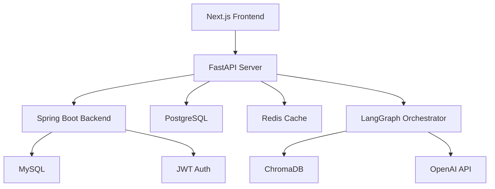

# 관세법 RAG 챗봇 FastAPI 서비스

기존 LangGraph 기반 RAG 시스템을 FastAPI로 래핑한 REST API 서비스입니다.

## 🏗️ 아키텍처 개요



## 🚀 주요 기능

- **멀티 에이전트 대화**: 관세법, 규제정보, 민원상담 전문 에이전트
- **JWT 인증**: Spring Boot 백엔드와 연동된 토큰 기반 인증
- **세션 관리**: PostgreSQL 기반 대화 이력 저장 및 검색
- **캐싱 시스템**: Redis 기반 응답 캐싱으로 성능 최적화
- **비동기 처리**: 대용량 문서 검색 및 생성 작업 비동기 처리

## 📋 전제 조건

1. **Docker 환경**: data-tier의 PostgreSQL, Redis, ChromaDB 서비스 실행
2. **Python 환경**: Python 3.11 이상
3. **Spring Boot 백엔드**: JWT 토큰 발급 및 사용자 인증
4. **OpenAI API 키**: .env 파일에 설정 필요

## 🛠️ 설치 및 실행

### 1. 환경 변수 설정

```bash
# .env.example을 복사하여 .env 파일 생성
cp .env.example .env

# 필수 환경 변수 설정
nano .env
```

필수 설정:
- `OPENAI_API_KEY`: OpenAI API 키
- `JWT_SECRET`: Spring Boot와 동일한 JWT 시크릿 키

### 2. 의존성 설치

```bash
# FastAPI 전용 의존성 설치
pip install -r requirements-fastapi.txt

# 또는 기존 의존성 + FastAPI 의존성
pip install -r requirements.txt
pip install fastapi uvicorn[standard] sqlalchemy[asyncio] asyncpg redis aioredis python-jose[cryptography]
```

### 3. 데이터베이스 서비스 시작

```bash
# data-tier 디렉토리에서 Docker Compose 실행
cd ../../../data-tier
docker-compose up -d

# 서비스 상태 확인
docker-compose ps
```

서비스 확인:
- PostgreSQL: http://localhost:8082 (pgAdmin)
- Redis: http://localhost:8083 (Redis Insight)
- ChromaDB: http://172.30.1.40:8000

### 4. FastAPI 서버 실행

```bash
# 개발 서버 실행
python -m uvicorn app.main:app --reload --host 0.0.0.0 --port 8000

# 또는 직접 실행
python app/main.py
```

## 📚 API 문서

서버 실행 후 다음 URL에서 API 문서를 확인할 수 있습니다:

- **Swagger UI**: http://localhost:8000/docs
- **ReDoc**: http://localhost:8000/redoc
- **OpenAPI JSON**: http://localhost:8000/openapi.json

## 🔗 주요 엔드포인트

### 인증 (Authentication)
모든 API 호출 시 Authorization 헤더에 JWT 토큰이 필요합니다:
```
Authorization: Bearer <JWT_TOKEN>
```

### 헬스체크
```http
GET /api/v1/health/
GET /api/v1/health/detailed
```

### 채팅
```http
POST /api/v1/chat/message
Content-Type: application/json

{
  "message": "관세율은 어떻게 계산하나요?",
  "conversation_id": "optional-uuid"
}
```

### 대화 관리
```http
# 대화 목록 조회
GET /api/v1/conversations/

# 특정 대화 조회
GET /api/v1/conversations/{conversation_id}

# 대화 검색
GET /api/v1/conversations/search?q=관세율

# 대화 삭제
DELETE /api/v1/conversations/{conversation_id}
```

## 🗄️ 데이터베이스 스키마

### conversations 테이블
```sql
CREATE TABLE conversations (
    id UUID PRIMARY KEY,
    user_id INTEGER NOT NULL,
    title VARCHAR(200) NOT NULL,
    created_at TIMESTAMPTZ NOT NULL,
    updated_at TIMESTAMPTZ NOT NULL,
    last_message_at TIMESTAMPTZ,
    is_active BOOLEAN DEFAULT TRUE,
    message_count INTEGER DEFAULT 0,
    metadata JSONB
);
```

### messages 테이블
```sql
CREATE TABLE messages (
    id UUID PRIMARY KEY,
    conversation_id UUID REFERENCES conversations(id) ON DELETE CASCADE,
    role VARCHAR(20) NOT NULL,
    content TEXT NOT NULL,
    agent_type VARCHAR(50),
    created_at TIMESTAMPTZ NOT NULL,
    processing_time FLOAT,
    token_usage JSONB,
    metadata JSONB
);
```

### user_sessions 테이블
```sql
CREATE TABLE user_sessions (
    id UUID PRIMARY KEY,
    user_id INTEGER NOT NULL,
    jwt_token_hash VARCHAR(256) NOT NULL,
    created_at TIMESTAMPTZ NOT NULL,
    expires_at TIMESTAMPTZ NOT NULL,
    last_accessed_at TIMESTAMPTZ NOT NULL,
    is_active BOOLEAN DEFAULT TRUE,
    user_agent TEXT,
    ip_address VARCHAR(45),
    metadata JSONB
);
```

## 🗂️ 프로젝트 구조

```
app/
├── __init__.py
├── main.py                 # FastAPI 애플리케이션 엔트리포인트
├── core/                   # 핵심 모듈
│   ├── config.py          # 설정 관리
│   ├── database.py        # PostgreSQL 연결 관리
│   ├── redis_client.py    # Redis 캐싱 시스템
│   └── exceptions.py      # 커스텀 예외 처리
├── models/                 # SQLAlchemy 모델
│   ├── conversation.py    # 대화방 및 메시지 모델
│   └── user_session.py    # 사용자 세션 모델
├── services/              # 비즈니스 로직
│   ├── orchestrator_service.py    # LangGraph 래퍼
│   └── conversation_service.py    # 대화 관리 서비스
├── routers/               # API 라우터
│   ├── chat.py           # 채팅 API
│   ├── conversations.py  # 대화 관리 API
│   └── health.py         # 헬스체크 API
├── middleware/            # 미들웨어
│   ├── jwt_auth.py       # JWT 인증
│   └── logging_middleware.py     # 로깅
└── schemas/               # Pydantic 스키마
    ├── chat.py           # 채팅 요청/응답 스키마
    └── conversation.py   # 대화 스키마
```

## 🔧 개발 및 테스트

### 환경 확인
```bash
# 설정 검증
python -c "from app.core.config import validate_settings; validate_settings()"

# 데이터베이스 연결 테스트
python -c "
import asyncio
from app.core.database import init_db, db_manager
async def test(): 
    await init_db()
    result = await db_manager.health_check()
    print(result)
asyncio.run(test())
"
```

### 로그 확인
```bash
# 애플리케이션 로그
tail -f app/logs/chatbot_api.log

# Docker 서비스 로그
docker-compose -f ../../../data-tier/docker-compose.yml logs -f postgres redis chromadb
```

## 🚀 배포

### Docker 배포 (TODO)
```dockerfile
FROM python:3.11-slim

WORKDIR /app
COPY requirements-fastapi.txt .
RUN pip install -r requirements-fastapi.txt

COPY . .
CMD ["uvicorn", "app.main:app", "--host", "0.0.0.0", "--port", "8000"]
```

### 환경별 설정
- **development**: 디버깅 활성화, 자세한 로그
- **production**: 최적화된 성능, 보안 강화

## 🔍 트러블슈팅

### 자주 발생하는 문제

1. **PostgreSQL 연결 실패**
   ```bash
   # Docker 서비스 상태 확인
   docker-compose ps
   # 네트워크 연결 확인
   telnet 172.30.1.20 5432
   ```

2. **Redis 연결 실패**
   ```bash
   # Redis 서비스 확인
   docker exec -it customs-redis redis-cli ping
   ```

3. **ChromaDB 연결 실패**
   ```bash
   # ChromaDB 헬스체크
   curl http://172.30.1.40:8000/api/v1/heartbeat
   ```

4. **OpenAI API 오류**
   ```bash
   # API 키 확인
   python -c "import os; print('API Key:', os.getenv('OPENAI_API_KEY', 'Not Set')[:10]+'...')"
   ```

## 📊 모니터링

### 헬스체크 엔드포인트
- `/api/v1/health/`: 기본 상태
- `/api/v1/health/detailed`: 상세 상태 (DB, Redis, RAG 시스템)

### 메트릭스
- 응답 시간
- 토큰 사용량
- 캐시 히트율
- 에러율

## 🤝 기여

1. Fork the Project
2. Create your Feature Branch (`git checkout -b feature/AmazingFeature`)
3. Commit your Changes (`git commit -m 'Add some AmazingFeature'`)
4. Push to the Branch (`git push origin feature/AmazingFeature`)
5. Open a Pull Request