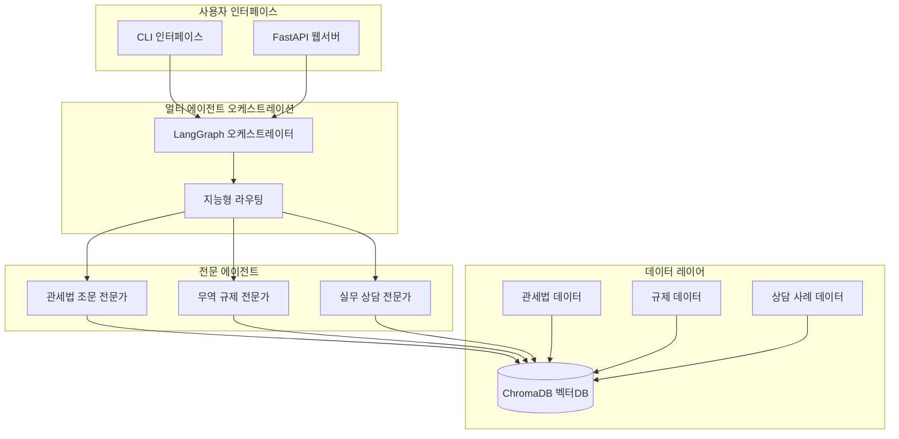

# Model-ChatbotNew: RAG 기반 관세법 AI 챗봇 시스템

> **한국 관세법 전문 멀티 에이전트 RAG (Retrieval-Augmented Generation) 시스템**

## 📋 프로젝트 개요

Model-ChatbotNew는 한국 관세법 및 무역 정보에 특화된 AI 챗봇 시스템입니다. **Retrieval-Augmented Generation (RAG)** 기술과 **LangGraph 기반 멀티 에이전트 오케스트레이션**을 통해 정확하고 실용적인 무역 정보를 제공합니다.

### 🎯 핵심 기능

- **🏛️ 관세법 조문 전문가**: 관세법, 관세법시행령, 관세법시행규칙 조문 해석
- **⚖️ 무역 규제 전문가**: 동식물 수입 허용국가, 수입/수출 규제 정보
- **💼 실무 상담 전문가**: 실제 민원상담 사례 기반 실무 안내
- **🧠 지능형 라우팅**: LangGraph 기반 자동 에이전트 선택
- **🌐 FastAPI 웹 서비스**: RESTful API 제공

### 🏗️ 시스템 아키텍처



## 📁 프로젝트 구조

```text
model-chatbotNew/
├── src/                           # 소스 코드 메인 디렉토리
│   ├── agents/                    # 에이전트 모듈
│   │   ├── __init__.py
│   │   ├── customs_law_agent.py   # 관세법 조문 전문 에이전트
│   │   ├── regulations_agent.py   # 무역 규제 전문 에이전트
│   │   └── complaints_agent.py    # 실무 상담 전문 에이전트
│   ├── orchestrator/              # 오케스트레이터
│   │   ├── __init__.py
│   │   └── orchestrator.py        # LangGraph 상태 그래프 정의
│   ├── utils/                     # 공통 도구
│   │   ├── __init__.py
│   │   ├── db_connect.py          # 벡터 DB 연결
│   │   ├── embeddings.py          # 임베딩 로직
│   │   ├── query_normalizer.py    # 질의 정규화
│   │   └── tools.py               # 유틸리티 함수
│   ├── data_processing/           # 데이터 처리 파이프라인
│   │   ├── __init__.py
│   │   ├── README.md
│   │   ├── csv_loader.py          # CSV 데이터 로더
│   │   ├── file_utils.py          # 파일 처리 유틸리티
│   │   ├── law_chunking_utils.py  # 법령 청킹 전략
│   │   ├── law_data_processor.py  # 법령 데이터 처리기
│   │   ├── law_document_loader.py # 법령 문서 로더
│   │   ├── pdf_chunking_utils.py  # PDF 청킹 도구
│   │   ├── pdf_processor.py       # PDF 처리기
│   │   └── trade_info_csv_loader.py # 무역정보 CSV 로더
│   ├── config/                    # 설정 (YAML/JSON 또는 .env 사용)
│   │   ├── __init__.py
│   │   └── config.py              # 전역 설정 관리
│   └── tests/                     # 단위 테스트
│       └── test_agents.py         # 에이전트 테스트
├── app/                           # FastAPI 웹서버
│   ├── main.py                    # FastAPI 애플리케이션 진입점
│   ├── core/                      # 핵심 구성요소
│   │   ├── __init__.py
│   │   ├── config.py              # FastAPI 설정
│   │   ├── database.py            # PostgreSQL 연결
│   │   ├── exceptions.py          # 커스텀 예외
│   │   └── redis_client.py        # Redis 캐시 클라이언트
│   ├── models/                    # Pydantic 데이터 모델
│   │   ├── __init__.py
│   │   ├── conversation.py        # 대화 모델
│   │   └── user_session.py        # 세션 모델
│   ├── routers/                   # API 라우터
│   │   ├── __init__.py
│   │   └── chat.py                # 채팅 API 엔드포인트
│   ├── services/                  # 비즈니스 로직
│   │   ├── __init__.py
│   │   ├── conversation_service.py # 대화 관리 서비스
│   │   └── orchestrator_service.py # 오케스트레이터 서비스 연동
│   └── middleware/                # 미들웨어
│       ├── jwt_auth.py            # JWT 인증
│       └── logging_middleware.py  # 로깅 미들웨어
├── data/                          # 데이터 저장소
│   ├── DCM/                       # Data Container Module
│   │   ├── raw_json/              # 원본 JSON 데이터
│   │   │   ├── 관세법.json
│   │   │   ├── 관세법시행령.json
│   │   │   └── 관세법시행규칙.json
│   │   ├── chunk_json/            # 처리된 청크 데이터
│   │   │   ├── customs_law.json
│   │   │   ├── consultation_cases.json
│   │   │   └── export_restrictions.json
│   │   ├── csv/                   # CSV 데이터
│   │   │   ├── 수입제한품목.csv
│   │   │   └── 동식물허용금지지역.csv
│   │   └── PDF/                   # PDF 원본 문서
│   │       ├── 관세행정민원상담사례집.pdf
│   │       └── 수입신고서작성요령.pdf
│   └── chroma_db/                 # ChromaDB 벡터 저장소
├── main.py                        # CLI 실행 파일
├── requirements.txt               # Python 의존성
├── requirements-fastapi.txt       # FastAPI 전용 의존성
├── .env                           # 환경변수 (생성 필요)
└── README.md                      # 프로젝트 문서
```

### 📝 주요 파일 역할

#### 🧠 **핵심 에이전트** (`src/agents/`)
- **`customs_law_agent.py`**: 관세법·시행령·시행규칙 조문 검색 및 해석
- **`regulations_agent.py`**: 무역규제·동식물검역·HS코드별 제한사항 처리  
- **`complaints_agent.py`**: 관세청 민원상담사례 기반 실무 가이드 제공

#### 🎯 **오케스트레이션** (`src/orchestrator/`)
- **`orchestrator.py`**: LangGraph 상태머신으로 지능형 에이전트 라우팅 관리

#### 🔧 **유틸리티** (`src/utils/`)
- **`db_connect.py`**: ChromaDB 벡터 데이터베이스 연결 및 CRUD
- **`embeddings.py`**: OpenAI 임베딩 모델 래핑 및 캐시 관리
- **`query_normalizer.py`**: 사용자 질의 전처리 및 정규화

#### 📊 **데이터 처리** (`src/data_processing/`)
- **`law_document_loader.py`**: JSON 법령 데이터 → 청크 변환
- **`csv_loader.py`**: CSV 무역정보 → 벡터DB 로딩
- **`pdf_processor.py`**: PDF 문서 파싱 및 청킹 처리

#### 🌐 **웹 서비스** (`app/`)
- **`main.py`**: FastAPI 애플리케이션 서버 진입점
- **`routers/chat.py`**: RESTful 채팅 API 엔드포인트
- **`services/orchestrator_service.py`**: 웹-CLI 오케스트레이터 브리지

#### 🗂️ **설정 및 실행**
- **`config/config.py`**: 품질 임계값, 모델 설정, 경로 관리
- **`main.py`**: CLI 멀티 에이전트 챗봇 실행기

## 🚀 빠른 시작

### 1. 환경 준비

```bash
# 저장소 클론
cd application-tier/models/model-chatbotNew

# 가상환경 생성 및 활성화
python -m venv .venv
source .venv/bin/activate  # Linux/macOS
# .venv\Scripts\activate   # Windows

# 의존성 설치
pip install -r requirements.txt
```

### 2. 환경 변수 설정

`.env` 파일 생성:

```env
# OpenAI API 키 (필수)
OPENAI_API_KEY=your_openai_api_key_here

# ChromaDB 설정 (선택사항, 기본값 사용 가능)
CHROMADB_HOST=localhost
CHROMADB_PORT=8011

# 기타 설정
LOG_LEVEL=INFO
```

### 3. 데이터베이스 설정 (ChromaDB)

```bash
# Docker를 통한 ChromaDB 실행 (권장)
docker run -p 8011:8000 chromadb/chroma:latest

# 또는 로컬 ChromaDB 사용 (기본 설정)
```

### 4. 시스템 실행

#### CLI 모드 (추천 - 완전한 기능)

```bash
# 통합 멀티 에이전트 시스템
python main.py

# 특정 에이전트 직접 실행
python main.py --agent customs_law     # 관세법 전문가
python main.py --agent regulations     # 규제 전문가
python main.py --agent complaints      # 상담 전문가
```

#### FastAPI 웹서버 모드

```bash
# 웹서버 실행
python app/main.py

# API 문서 확인
# http://localhost:8000/docs
```

### 5. 첫 사용 - 데이터 로드

시스템 첫 실행시 메뉴에서 **"5. 데이터베이스 관리"**를 선택하여:

1. **관세법 데이터 로드**: 관세법, 관세법시행령, 관세법시행규칙
2. **무역 정보 데이터 로드**: 무역 규제, 동식물 검역, 민원상담 사례

## 🧠 멀티 에이전트 아키텍처

### 지능형 라우팅 시스템

```python
# 사용자 질의 → LangGraph 분석 → 최적 에이전트 선택

"딸기를 어느 나라에서 수입할 수 있나요?"
→ 🧠 분석: 동식물 수입 질의 감지
→ ⚖️ 무역 규제 전문가로 라우팅
→ 📊 벡터 검색: 딸기 관련 허용국가 정보
→ 💬 생성: "딸기는 미국, 칠레, 네덜란드에서 수입 가능합니다..."
```

### 전문 에이전트별 특화

#### 🏛️ 관세법 조문 전문가 (`customs_law_agent`)

- **전문 분야**: 관세법, 관세법시행령, 관세법시행규칙 조문
- **데이터 소스**: 법령 조문 청크 (5,000+ 조문)
- **검색 방식**: 조문 인덱스 + 의미 검색
- **응답 특징**: 정확한 법조문 인용, 계층 구조 설명

```python
# 예시 질의
"관세법 제5조의 내용은 무엇인가요?"
→ 법령 데이터베이스에서 정확한 조문 검색
→ 상위 계층 정보 포함 답변
```

#### ⚖️ 무역 규제 전문가 (`regulations_agent`)

- **전문 분야**: 수입/수출 규제, 동식물 검역, HS코드별 제한사항
- **데이터 소스**: 무역 규제 DB + 동식물 허용국가 정보
- **검색 방식**: 키워드 부스팅 + 의미 검색
- **응답 특징**: 실용적 규제 정보, 허용국가 목록

```python
# 예시 질의
"미국산 쇠고기 수입 규제는 어떻게 되나요?"
→ 동식물 검역 데이터 + 국가별 규제 정보 검색
→ 구체적 수입 조건 및 절차 안내
```

#### 💼 실무 상담 전문가 (`complaints_agent`)

- **전문 분야**: 수입/수출 절차, 실무 가이드, 비용 정보
- **데이터 소스**: 관세청 민원상담 사례집 (1,000+ 사례)
- **검색 방식**: 사례 기반 검색 + 의미 유사도
- **응답 특징**: 실무적 해결책, 단계별 절차 안내

```python
# 예시 질의
"수입신고서 작성 방법을 알려주세요"
→ 실제 민원상담 사례에서 유사 질의 검색
→ 단계별 작성 가이드 + 주의사항 제공
```

## 💾 데이터 파이프라인

### 데이터 구조

```
data/
├── DCM/                          # 데이터 컨테이너 모듈
│   ├── raw_json/                 # 원본 JSON 데이터
│   │   ├── 관세법.json
│   │   ├── 관세법시행령.json
│   │   └── 관세법시행규칙.json
│   ├── chunk_json/               # 처리된 청크 데이터
│   │   ├── customs_law.json
│   │   ├── export_restrictions.json
│   │   └── consultation_cases.json
│   └── csv/                      # CSV 형태 데이터
│       ├── 수입제한품목.csv
│       └── 동식물허용금지지역.csv
└── chroma_db/                    # ChromaDB 벡터 저장소
```

### 데이터 처리 파이프라인


### 지능형 청킹 전략

```python
def determine_chunking_strategy(article):
    """조문 복잡도에 따른 청킹 전략 결정"""
    paragraph_count = len(article.get("항", []))
    
    if paragraph_count >= 3:
        return "paragraph_level"  # 항 단위 분할
    else:
        return "article_level"    # 조 단위 유지
```

## 🔧 설정 및 커스터마이징

### 품질 설정 (`src/config/config.py`)

```python
QUALITY_THRESHOLDS = {
    "similarity_threshold": 0.0,        # 검색 유사도 임계값
    "model_temperature": 0.1,           # 생성 모델 창의성
    "regulation_temperature": 0.15,     # 규제 에이전트 전용
    "consultation_temperature": 0.2,    # 상담 에이전트 전용
    "animal_plant_score_threshold": 0.7 # 동식물 질의 감지 임계값
}
```

### 에이전트별 파라미터

| 에이전트 | 최대 문서 수 | 온도 설정 | 특화 기능 |
|---------|-------------|----------|-----------|
| 관세법 | 5개 | 0.1 | 조문 인덱스 매칭 |
| 규제 | 8개 | 0.15 | 키워드 부스팅 |
| 상담 | 8개 | 0.2 | 사례 기반 검색 |

## 🌐 FastAPI 웹 서비스

### API 엔드포인트

```http
# 기본 정보
GET  /                           # 서비스 정보
GET  /api/v1/health             # 헬스 체크

# 채팅 서비스 (JWT 인증 필요)
POST /api/v1/chat               # 채팅 요청
GET  /api/v1/conversations      # 대화 기록 조회
```

### 채팅 API 사용 예시

```bash
# 채팅 요청
curl -X POST "http://localhost:8000/api/v1/chat" \
  -H "Authorization: Bearer YOUR_JWT_TOKEN" \
  -H "Content-Type: application/json" \
  -d '{
    "message": "딸기 수입 가능한 국가는 어디인가요?",
    "session_id": "session_123"
  }'

# 응답
{
  "success": true,
  "response": "딸기는 다음 국가에서 수입이 가능합니다:\n- 미국\n- 칠레\n- 네덜란드\n...",
  "agent_used": "regulations_agent",
  "session_id": "session_123",
  "timestamp": "2025-01-08T10:30:00Z"
}
```

## 📊 모니터링 및 성능

### 시스템 상태 확인

```python
# CLI에서 시스템 상태 확인
python main.py
# → 메뉴 6번: 시스템 상태 확인

# 또는 프로그래밍 방식
from src.orchestrator.orchestrator import get_orchestrator_factory

factory = get_orchestrator_factory()
stats = factory.get_agent_stats()
print(stats)
```

### 성능 메트릭

- **응답 속도**: 평균 2-5초 (복잡도에 따라)
- **정확도**: 법령 정보 95%+, 실무 정보 90%+
- **메모리 사용량**: 약 500MB-1GB (벡터 DB 포함)
- **동시 처리**: FastAPI 비동기 처리 지원

## 🔍 사용 사례 및 예시

### 일반적인 질의 시나리오

#### 1. 법령 조문 질의
```
사용자: "관세법 제5조 내용이 뭔가요?"
시스템: 🏛️ 관세법 전문가 연결
응답: "관세법 제5조(세관공무원의 질문·검사)는 다음과 같습니다..."
```

#### 2. 동식물 수입 질의
```
사용자: "망고를 수입할 수 있는 나라는?"
시스템: ⚖️ 규제 전문가 연결 (동식물 질의 자동 감지)
응답: "망고는 다음 국가에서 수입 가능합니다: 태국, 필리핀, 베트남..."
```

#### 3. 실무 절차 질의
```
사용자: "수입신고서 작성 방법을 알려주세요"
시스템: 💼 상담 전문가 연결
응답: "수입신고서 작성 절차는 다음과 같습니다..."
```

### 복합 질의 처리

```python
# 시스템이 자동으로 복잡도 분석 후 적절한 에이전트 선택
"딸기 수입 절차와 관련 법령을 알려주세요"
→ 복잡도: 0.8 (규제 + 절차 정보 필요)
→ 1차: 규제 전문가 (허용국가 확인)
→ 2차: 상담 전문가 (절차 안내)
```

## 🛠️ 개발 및 확장

### 새로운 에이전트 추가

```python
# 1. 에이전트 클래스 생성
class NewSpecialAgent:
    def query_special(self, user_query: str):
        # 특화 로직 구현
        pass

# 2. 오케스트레이터에 등록
orchestrator.set_agents(
    customs_law_agent=law_agent,
    regulations_agent=reg_agent,
    complaints_agent=cons_agent,
    new_special_agent=new_agent  # 추가
)

# 3. 라우팅 로직 업데이트
# src/orchestrator/orchestrator.py의 routing_prompt 수정
```

### 데이터 소스 추가

```python
# 1. 데이터 처리 파이프라인 확장
from src.data_processing import CustomDataProcessor

# 2. 새로운 컬렉션 생성
new_vector_store = LangChainVectorStore(
    collection_name="new_collection",
    embedding_function=embedder.embeddings
)

# 3. 에이전트에 연결
agent.add_data_source(new_vector_store)
```

## 🔐 보안 및 인증

### JWT 인증 (FastAPI)

```python
# JWT 토큰 생성 (별도 인증 시스템 필요)
headers = {
    "Authorization": "Bearer your_jwt_token"
}

# 보호된 엔드포인트 접근
response = requests.post(
    "http://localhost:8000/api/v1/chat",
    headers=headers,
    json={"message": "질의 내용"}
)
```

### 데이터 보안

- **민감 정보 로깅 방지**: 사용자 질의 및 응답 로깅 제한
- **접근 제어**: JWT 기반 API 접근 제어
- **데이터 암호화**: 벡터 DB 연결 시 TLS 사용 권장

## 🐛 문제 해결

### 일반적인 문제

#### Q: "OPENAI_API_KEY 환경변수가 설정되지 않았습니다"
```bash
# .env 파일 확인 또는 직접 설정
export OPENAI_API_KEY="your_key_here"
```

#### Q: ChromaDB 연결 실패
```bash
# Docker 컨테이너 실행 확인
docker ps | grep chroma

# 포트 확인 (기본: 8011)
netstat -tulpn | grep 8011
```

#### Q: 데이터 로드 실패
```bash
# 데이터 파일 존재 확인
ls data/DCM/chunk_json/

# 권한 확인
chmod -R 755 data/
```

#### Q: 메모리 부족
```bash
# 배치 크기 조정 (config.py)
BATCH_SIZE = 50  # 기본 100에서 감소

# 또는 Docker 메모리 할당 증가
docker run -m 2g chromadb/chroma
```

### 디버깅 모드

```bash
# 상세 로깅 활성화
python main.py --verbose

# 또는 환경변수로 설정
export LOG_LEVEL=DEBUG
python main.py
```

## 📈 성능 최적화

### 벡터 검색 최적화

```python
# 유사도 임계값 조정으로 검색 품질 vs 속도 조절
SIMILARITY_THRESHOLD = 0.1  # 낮을수록 더 많은 결과, 느림
```

### 메모리 최적화

```python
# 에이전트별 문서 수 제한
MAX_CONTEXT_DOCS = {
    "customs_law": 5,    # 법령은 정확성 중요
    "regulations": 8,    # 규제는 폭넓은 정보 필요  
    "complaints": 8      # 상담은 다양한 사례 참조
}
```

## 🤝 기여 가이드

### 코드 스타일

```python
# Google Style Docstring 사용
def process_query(self, query: str) -> Dict[str, Any]:
    """사용자 질의를 처리합니다.
    
    Args:
        query: 사용자 입력 질의
        
    Returns:
        처리 결과 딕셔너리
        
    Raises:
        ValueError: 질의가 빈 문자열인 경우
    """
```

### 테스트

```bash
# 단위 테스트 실행
python -m pytest src/tests/

# 통합 테스트
python -m pytest src/tests/integration/
```

## 📄 라이선스

이 프로젝트는 교육 목적으로 개발된 프로토타입입니다. 상용 사용시 관련 라이선스를 확인하시기 바랍니다.

## 📞 지원 및 문의

- **개발팀**: AIVLE 빅프로젝트 관세시스템팀
- **프로젝트 저장소**: `customs-clearance/application-tier/models/model-chatbotNew/`
- **기술 스택**: Python, FastAPI, LangGraph, ChromaDB, OpenAI

---

## 🔄 업데이트 히스토리

### v1.0.0 (2025-01-08)
- ✨ LangGraph 기반 멀티 에이전트 오케스트레이션 구현
- 🏛️ 관세법 조문 전문가 에이전트 완성
- ⚖️ 무역 규제 전문가 에이전트 완성
- 💼 실무 상담 전문가 에이전트 완성
- 🌐 FastAPI 웹 서비스 통합
- 📊 ChromaDB 벡터 데이터베이스 연동
- 🧠 지능형 질의 라우팅 시스템 구현
- 📝 종합 문서화 완료

---

**🚀 한국 관세법 전문 AI 챗봇과 함께 더 스마트한 무역업무를 경험하세요!**